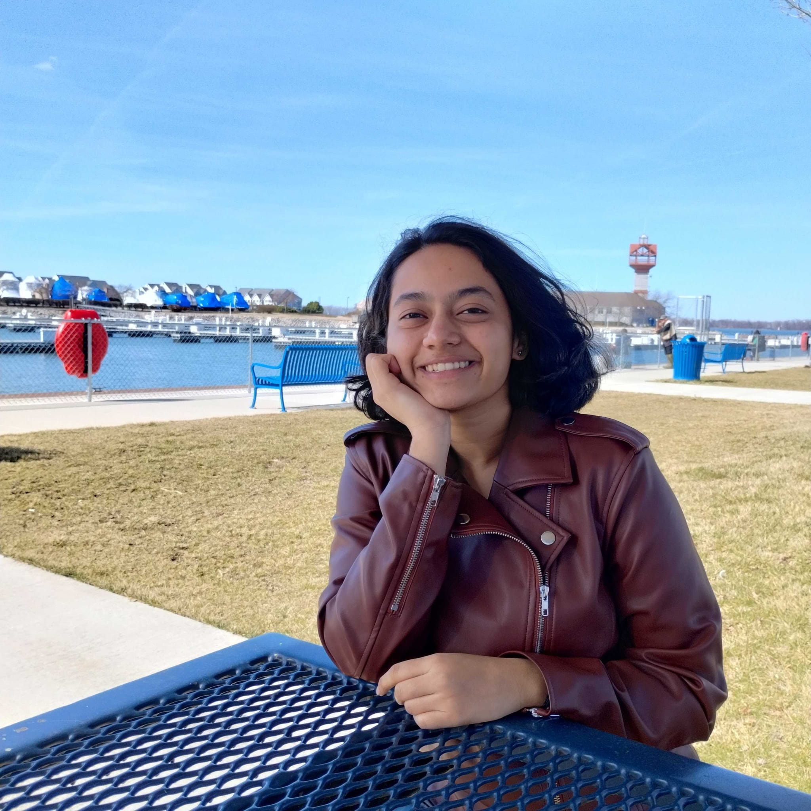

<link rel="stylesheet" type="text/css" href="styles.css">

<nav>
  <a href="index.md">Home</a>
  <a href="about.md">About Me</a>
  <a href="projects.md">Projects</a>
  <a href="research.md">Research</a>
  <a href="publications.md">Publications</a>
  <a href="resume.md">Resume</a>
  <a href="futuregoals.md">Future Goals</a>
</nav>

# Welcome to My Personal Website

Hi, I'm **Srinidhi Narayanan**, a Master's student in Biomedical Engineering at Carnegie Mellon University. My research focuses on **auditory neuroscience**, particularly in the areas of **synaptopathy**, **statistical learning**, and **speech-in-noise processing**. I aspire to become a **Neuroscience professor**, contributing to the field of **language development and cognitive neuroscience**.

## Sections
- [About Me](about.md)
- [Research](research.md)
- [Projects](projects.md)
- [Resume](resume.md)
- [Publications](publications.md)
- [Future Goals](futuregoals.md)
